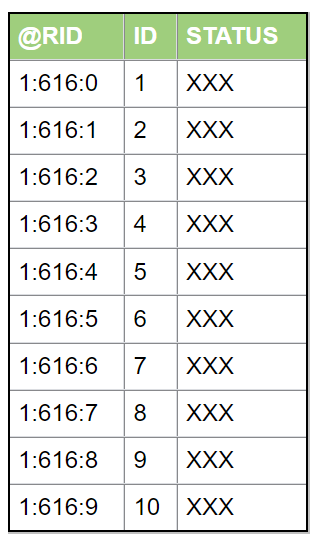
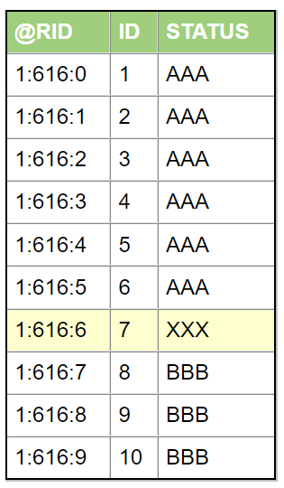
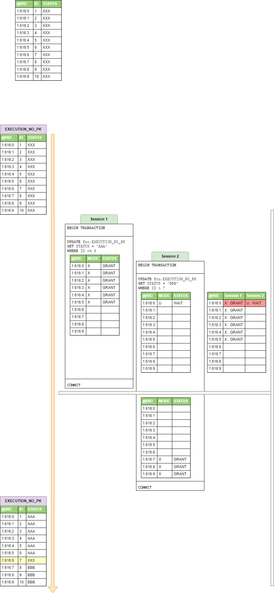
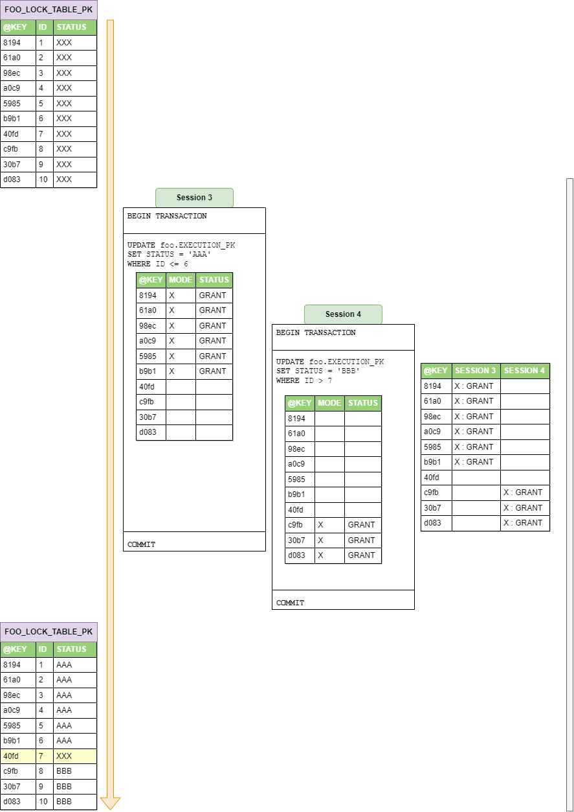

# MSSQL locking use-cases

In this repository I want to show various MSSQL locking scenarios in detail.

- **Lock escalation** threshold detection
- Locking transaction for defined time - with **MVCC**
- Behavior of **row locking** on column with or without index

Mind that to be able to run following examples you have to start prepared Dockerized MSSQL by running
command `docker compose up`.

## Lock escalation threshold detection

For concurrent access to shared objects between transaction DB server uses locking.
Because transaction can require to lock too many objects, for example table rows, and this action could eat too much DB
server's memory, MSSQL uses mechanism called "lock escalation" to mitigate this waste of memory.

There are various places where this is described in detail,
like [https://www.sqlshack.com/locking-sql-server/](https://www.sqlshack.com/locking-sql-server/)
and [https://learn.microsoft.com/en-us/sql/relational-databases/sql-server-transaction-locking-and-row-versioning-guide?view=sql-server-ver16#lock-escalation](https://learn.microsoft.com/en-us/sql/relational-databases/sql-server-transaction-locking-and-row-versioning-guide?view=sql-server-ver16#lock-escalation).

Basically it works as following:

- when DB server wants to lock rows, it takes some small amount of memory
- if some threshold of locks of objects is reached, then lock escalation takes places
- it goes to upper level
    - from row to page
    - from page to table
    - from table to database
- in reality, **only escalation from ROW to TABLE occurs**

From various places on the Internet is described that threshold is 5000 locks.

Unfortunately from various test-cases it looks like that this number is not fixed. Based on this
documentation [https://learn.microsoft.com/en-us/sql/database-engine/configure-windows/configure-the-locks-server-configuration-option?view=sql-server-ver16](https://learn.microsoft.com/en-us/sql/database-engine/configure-windows/configure-the-locks-server-configuration-option?view=sql-server-ver16),
it looks like that it is based on memory consumption.

### Application to find threshold value for lock escalation

To be able to find out correct value you can run this Spring Boot application with Spring's
profile `find-lock-escalation-threshold`.

Mind that there is `docker-compose.yaml` that has to be run to start local MSSQL DB server to experiment with.

Also, mind that escalation seems detected differently when MSSQL 2017, 2019, and 2022 is started.

To find threshold value we use [Bisection method](https://en.wikipedia.org/wiki/Bisection_method)
in `FindLockEscalationThreshold` class.

Mind that there is local variable `count` with sweet spot number 10000 to find out correct value. If application fails
to find threshold, this value should be increased accordingly.

For my configuration of dockerized MSSQL result value is **`6207` row locks**.

## Locking transaction for defined time - with MVCC

To improve DB read operations performance DBs
implement [Multiversion concurrency control (MVCC)](https://en.wikipedia.org/wiki/Multiversion_concurrency_control).

TLDR; **We do not wait with Read operations when concurrent transaction with write operation is currently processed.**

In MSSQL universe this mode is called "Read Committed Snapshot Isolation" and you can find mode detail description here:

- [MSSQL documentation](https://learn.microsoft.com/en-us/dotnet/framework/data/adonet/sql/snapshot-isolation-in-sql-server?redirectedfrom=MSDN)
- [Tutorial with description 1 at sqlperformance.com](https://sqlperformance.com/2014/05/t-sql-queries/data-modifications-under-rcsi)
- [Tutorial with description 2 at mssqltips.com](https://www.mssqltips.com/sqlservertip/6368/sql-server-readcommittedsnapshot-database-option-and-read-commited-transaction-isolation-level/)

To enable this mode we have to run following command:

```sql
ALTER
DATABASE MyDatabase
SET READ_COMMITTED_SNAPSHOT ON
```

To demonstrate waiting time between two transactions we created two DBs:

- `TxWaitDB` with flag turned `OFF`
- `TxWaitMVCCDB` with flag turned `ON`

Next we have Spring bean `TxWaitMVCC` that can operate in two modes, one with MVCC DB and second without.

To run sample application in have two Spring profiles that has to be run

- `tx-wait` with waiting to write operation
- `tx-wait-mvcc` **without** waiting to write operation

Steps to reproduce this are very simple:

- Let's have two threads
    - 1st with **write transaction** on the table `TestTable`
      ```sql
      UPDATE TestTable
       SET Val='X'
      WHERE Val='A'
      WAITFOR DELAY '00:00:15'
      ```
        - Mind that we are making this transaction wait 15 seconds to see that second transaction is waiting or not
    - 2nd with **read transaction** on same table
      ```sql
      SELECT * FROM TestTable
      ```
- Execute them concurrently and measure how long they have been processing

### Execution without MVCC

As you can see from terminal output we start two transactions in two threads.

- `Tx1` is write operation with `WAITFOR DELAY` set to 15 seconds.
- `Tx2` waits for 5 seconds (to allow `Tx1` fully start) and then start to read from same table.
- At the end both transactions are committed.

As you can see from last log lines:

- `Tx1` was waiting 15 seconds
- `Tx2` was waiting 10 seconds
    - (15s total - 5s start-wait)
    - It is because there was lock holding on same resource

```commandline
2023-04-04T10:07:31.683618300 [main]> Drop table: TestTable
2023-04-04T10:07:31.712063100 [main]> Drop table: TestTable2
2023-04-04T10:07:31.725153800 [main]> Create table: TestTable
2023-04-04T10:07:31.737853600 [main]> Create table: TestTable2
2023-04-04T10:07:31.750779600 [main]> Fill table with data:TestTable
2023-04-04T10:07:31.764965900 [main]> Fill table with data:TestTable2
2023-04-04T10:07:31.778577100 [pool-2-thread-1]> Begin Tx1
2023-04-04T10:07:31.780098700 [pool-2-thread-2]> Sleep Tx2
2023-04-04T10:07:36.790213200 [pool-2-thread-2]> Begin Tx2
2023-04-04T10:07:46.809153200 [pool-2-thread-1]> End Tx1
2023-04-04T10:07:46.822856000 [pool-2-thread-2]> End Tx2
2023-04-04T10:07:46.824493100 [main]> Tx1 time=15.0294848
2023-04-04T10:07:46.825057000 [main]> Tx2 time=10.0323616
```

### Execution with MVCC enabled

As you can see from terminal output we start two transactions in two threads.

- `Tx1` is write operation with `WAITFOR DELAY` set to 15 seconds.
- `Tx2` waits for 5 seconds (to allow `Tx1` fully start) and then start to read from same table.
- At the end both transactions are committed.

As you can see from last log lines:

- `Tx1` was waiting 15 seconds
- `Tx2` was waiting fraction of 1 second
    - Because we have MVCC enabled for read operations and second transaction was not waiting for first one to finish
      it's job

```commandline
2023-04-04T10:14:17.886096500 [main]> Drop table: TestTable
2023-04-04T10:14:17.912433800 [main]> Drop table: TestTable2
2023-04-04T10:14:17.924256300 [main]> Create table: TestTable
2023-04-04T10:14:17.938916400 [main]> Create table: TestTable2
2023-04-04T10:14:17.951502400 [main]> Fill table with data:TestTable
2023-04-04T10:14:17.974482000 [main]> Fill table with data:TestTable2
2023-04-04T10:14:17.991204800 [pool-2-thread-1]> Begin Tx1
2023-04-04T10:14:17.991778200 [pool-2-thread-2]> Sleep Tx2
2023-04-04T10:14:23.004751600 [pool-2-thread-2]> Begin Tx2
2023-04-04T10:14:23.034798800 [pool-2-thread-2]> End Tx2
2023-04-04T10:14:33.022019200 [pool-2-thread-1]> End Tx1
2023-04-04T10:14:33.024239200 [main]> Tx1 time=15.0306775
2023-04-04T10:14:33.024239200 [main]> Tx2 time=0.0293795
```

## Behavior of row locking on column with or without index

Another interesting behavior is how MSSQL is locking records when we are updating particular rows. Usually we have
scenario
where we update records based on some condition, for example `WHERE id = 123`.

From observations and documentation we know that to be able to update records DB server has to lock particular records
for some time. We also know that we have multiple types of locks and there are rules defined for situations where
transactions block each other in case of contention on same resource, eg. table records.

Mind that in theory when we update only distinct part of the table, we should expect that there is not going to be any
resource contention.

We can have two scenarios of updating records:

- based on column values that are part of some index
- or based on column values that are **NOT** part of some index

Links:
https://dba.stackexchange.com/questions/174605/extended-event-for-lock-count-does-not-show-locks
https://www.sqlshack.com/concurrency-problems-theory-and-experimentation-in-sql-server/
https://www.mssqltips.com/sqlservertip/5100/lesson-on-sql-server-deadlocks-and-how-to-solve/
https://dba.stackexchange.com/questions/310373/what-locks-are-held-during-an-update
https://dba.stackexchange.com/questions/273711/update-statement-behavior
https://dba.stackexchange.com/questions/72029/why-are-u-locks-required-when-using-read-committed-snapshot-isolation
https://dba.stackexchange.com/questions/316607/when-avoiding-mssql-deadlock-on-fk-insert-is-it-good-ideat-to-just-remove-fk
https://stackoverflow.com/questions/71486790/deadlock-caused-by-multiple-on-delete-cascade-foreign-keys/71501241#71501241
https://www.mssqltips.com/sqlservertip/5191/lessons-to-solve-sql-server-deadlocks-with-foreign-keys-part-2/

### Test data description

Let's have **table** with following records:



**First transaction** is going to update top part of the table:

```sql
UPDATE TABLE_NAME
SET STATUS = 'AAA'
WHERE ID <= 6
``` 

**Second transaction** is going to update bottom part of the table:

```sql
UPDATE TABLE_NAME
SET STATUS = 'BBB'
WHERE ID > 7
``` 

Result has to be table with some records with `STATUS == 'XXX`, some with `STATUS == 'AAA`, and other
with `STATUS == 'BBB`.



### Example on two tables, with different indexes

When we have table that we want to update on column without index, we can see following behavior. See bean
`RowLockWithAndWithoutUpdateOnKey` and it's Spring profile `row-lock-with-and-without-update-on-key` to run this sample.

1. Start transaction Tx1
2. Update first set of records
3. Start transaction Tx2
4. Tx2 is waiting until `UPDATE` statement from Tx1 is executed
5. Tx1 after `UPDATE` execution is going to sleep for 10 seconds, to simulate long-running transaction and see lock
   waiting in real-time
6. After Tx1 update of records and waiting for some time, Tx2 is going to update different part of the table

#### Update on table without index

Mind that we are operating on table `foo.FOO_LOCK_TABLE_NO_PK`.

In theory, **this has to run in parallel**, because we are not updating same records but two distinct set of records.
**But in reality second transaction Tx2 is waiting to first transaction Tx1**.

**Question** is "why"? From log, we can see that second transaction is waiting until first record in the table will be
freed from the lock.

**Answer** is pretty simple: It is because we are updating records based on column that does not have index. In that
case execution plan has to go record one by one to check if it fulfills condition of `WHERE` statement. And because we
have beginning of the table locked by first transaction Tx1 we have to wait until lock are freed.



#### Update on table with index

Mind that we are operating on table `foo.FOO_LOCK_TABLE_PK`.

In contrast to first example we can see that **second transaction Tx2 is not waiting for first
transaction Tx1 to finish**.

**Question** is "why"? In the logs we can see details.

**Answer** is pretty simple: It is because we are updating records based on column that does have index. In that
case execution plan is selecting records based on particular index and tables rows are not locked.


